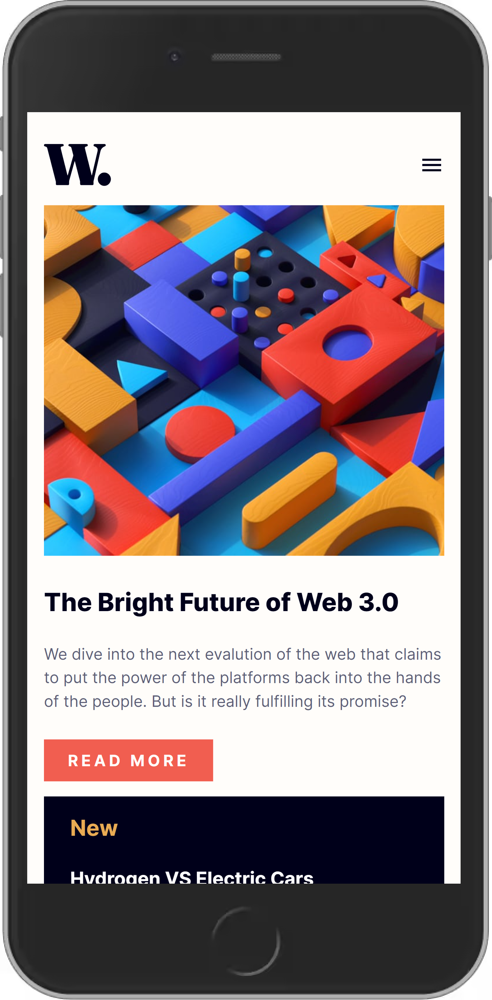
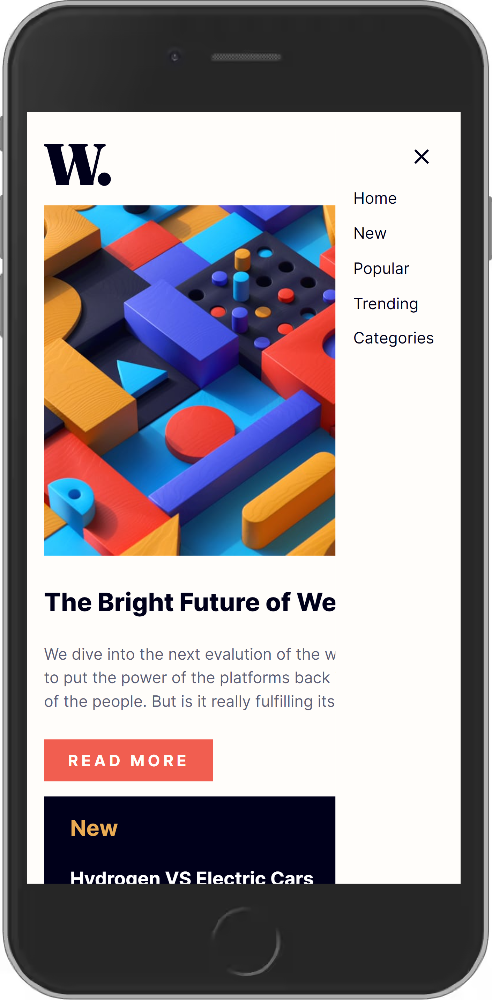
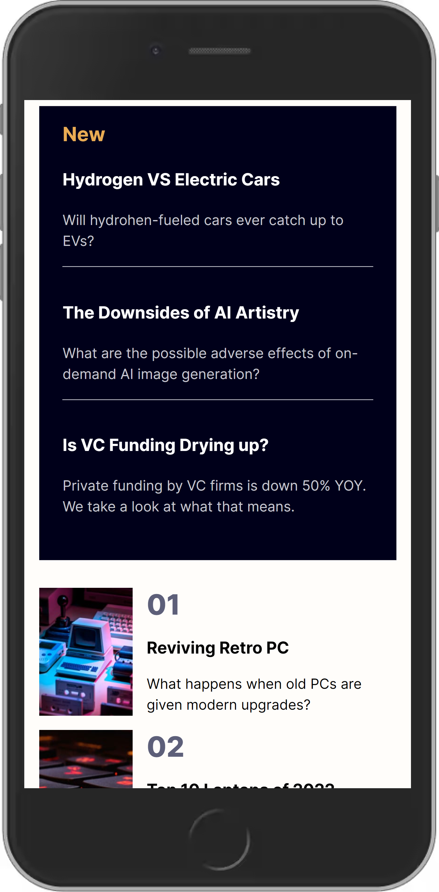

# Frontend Mentor Challenge - News Homepage

The challenge was to build out a responsive news homepage and get it looking as close to the provided design as possible.

[Click here to see the result.](https://bnayakahalani.github.io/news-homepage/)

Tools I used: React, Sass and Vite.

Here are some photos of the final product:

   
   
   

    

## What I Learned from this Project?

The focus in this project was to plan and implement the layout and design using CSS Grid Layout Module, and it indeed game me the opportunity to practice these important skills. In fact, this project contains a grid inside a grid structure, which is quite challenging. Nevertheless, the use of grid is very useful, and I believe I'll use it even more extensively in my next projects.
